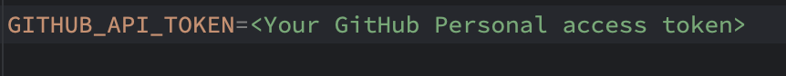
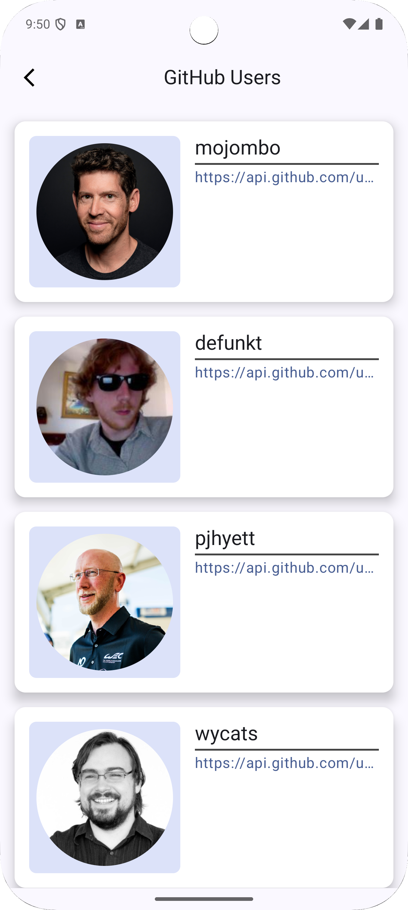
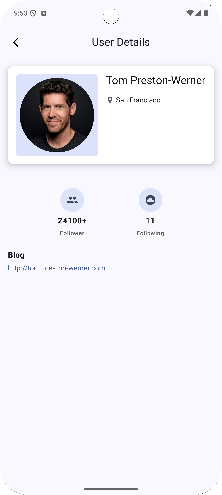

# GitHub Users Browser 📱

An Android app that allows administrators to browse and explore users from the GitHub platform. Built using modern Android development practices and a clean architecture approach.

## 🚀 Features

- 🔍 Browse GitHub users in a paginated list (20 users per fetch).
- 📜 Infinite scrolling to load more users.
- 📄 Detailed user information available on tap.
- ⚡ Users' data loads instantly when app is launched again (cache support or retained state).
- 🧪 Tested loading, error, and UI rendering states.

---

## 📖 User Story

> As an administrator, it is possible to browse all users who are the members of GitHub site then we can see more detailed information about them.

---

## ✅ Acceptance Criteria

- ✅ The administrator can look through fetched users’ information.
- ✅ The administrator can scroll down to see more users’ information with 20 items per fetch.
- ✅ Users’ information must be shown immediately when the administrator launches the application for the second time.
- ✅ Clicking on an item will navigate to the page of user details.

---

## 🧩 Tech Stack

- **Language**: Kotlin
- **UI Toolkit**: Jetpack Compose
- **Dependency Injection**: Koin
- **Image Loading**: Coil
- **Networking**: Retrofit + OkHttp
- **Local Storage**: Datastore
- **Architecture**: MVVM + Clean Architecture
- **Paging**: Jetpack Paging 3
- **Multi-Module Project Structure**: 
  - `shared-test`: Shared base unit test
  - `core`: Shared utilities and UI components
  - `user_data`: Repository and API logic
  - `user-domain`: Business logic and use cases
  - `user_ui`: Feature module for user interface
  - `app`: Main entry point and navigation

---

## 🧪 Unit & UI Testing

- ✅ Paging source tested
- ✅ Datastore source tested
- ✅ Repository logic tested
- ✅ UseCase source tested
- ✅ ViewModel logic tested

---

## 🔧 Setup & Run

1. Clone this repository
2. Open in **Android Studio**
3. Copy and add your Github's PAT to local.properties following the format below

4. Build and Run on an emulator or real device (API 24+ recommended)

---

## 📸 Screenshots

| Home | Detail |
|------|--------|
|  |  |

---

## 💡 Future Improvements

- Add search functionality
- Implement user caching for offline mode
- Improve animations and transitions
